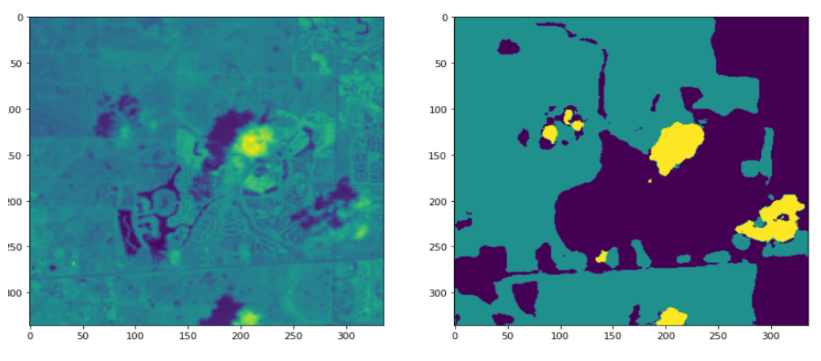

# Computer Vision - Semantic Segmentation. 

This repository contains a solution for a Computer vision (semantic segmentation) task. Based on dataset of satellite imagery and associated labels, the goal is to design, 
implement and evaluate model that would be capable to predict label to the unseen picture. 

Each pixel of the image from training data is labeled to the one of 3 categories
- Urban 
- Non Urban
- Cloud

Because the goal is not to classify whole image to one class, but each pixel of the image to some class, it is so called semantic segmentation problem (not image classification). 

Afterwards, urban growth index should be constructed from model's predictions.

For full description of the problem, proposed and documented solution, please see the [report](https://github.com/pacaklu/Computer_Vision_semantic_segmentation/blob/master/LP_Report.pdf) file.  
Whole dataset is not enclosed from legal reasons.
